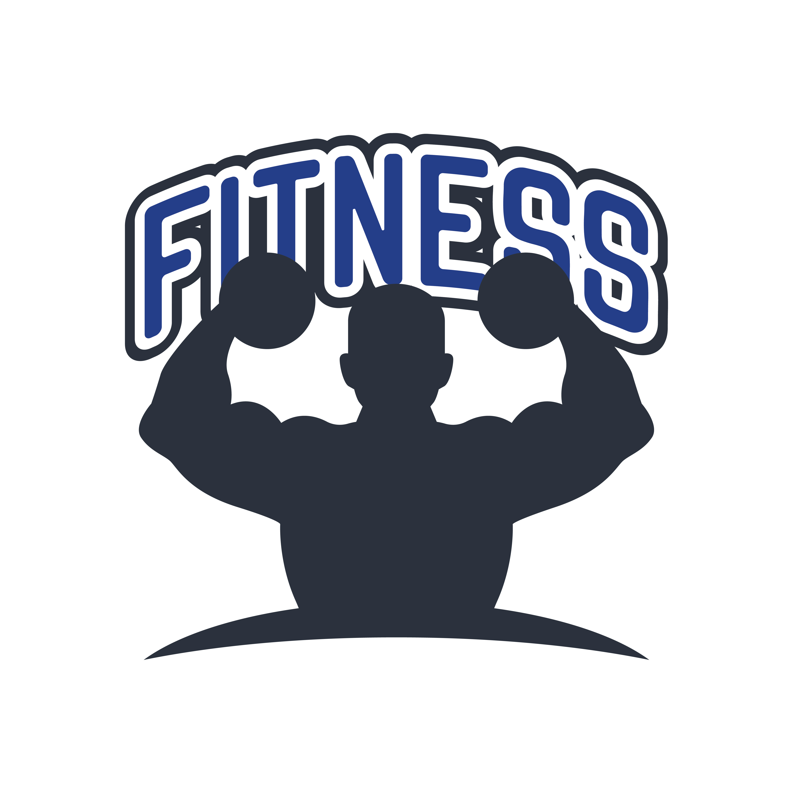
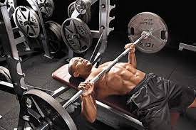
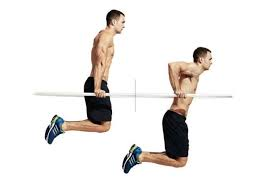
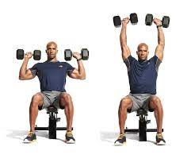

# [운동 소개앱](https://dazzling-genie-bf6e40.netlify.app/%EC%9A%B4%EB%8F%99%20%EC%86%8C%EA%B0%9C%20%EC%95%B1/work-intro.html) <br>


## 메인 화면

각 부위 별 운동 설명 <br>
하체
운동 도움 영상 <br>
운동 할때 들을만한 노래 <br>
운동 사진 등이 들어있다.<br>

```
<div data-role="page" id="home">
	<div data-role="header" data-theme="b">
		<h1>운동 소개 앱</h1>
	</div>
	<div data-role="content" style="text-align:center">
			
		<ul data-role="listview" data-inset="true">
			<li><a href="#intro1">상체 운동 설명</a></li>
			<li><a href="#intro2">하체 운동 설명</a></li>
			<li><a href="#movie">운동 영상</a></li>
			<li><a href="#wizard3-1">운동 음악</a></li>
			<li><a href="#gallery">운동 사진</a></li>
		</ul>
	</div>
	<div data-role="footer" data-position="fixed" data-theme="b">
		<h1></h1>
	</div>
</div>
```

<br><br><br>

## 각 부위 별 운동 설명

각 부위 별 운동에서 상체를 선택시 <br>
상체운동에 해당되는 운동의 목록이 나오며 <br>
클릭시 사진과 같이 운동의 설명이 나오게 된다.

```
<div data-role="page" id="intro1" data-theme="b">
	<div data-role="header" data-theme="b">
		<a href="#home" data-icon="arrow-l" data-direction="reverse">처음</a>			
		<h1>상체 운동 설명</h1>
	</div>
	<div data-role="content">
		<div  style="text-align:center">
		
	</div>			
	<div data-role="collapsible-set" data-theme="b" data-content-theme="e">
		<div data-role="collapsible">
			<h3>벤치 프레스</h3>
			<p>웨이트 트레이닝 3대 운동 중 하나답게 운동 효과가 매우 뛰어나다. 
			<br>거대한 가슴 근육 발달에는 벤치 프레스만한 운동이 없으며 가슴뿐만 아니라 어깨, 삼두 등 상체 근육 전반을 그 어떤 운동보다도 고중량으로 소화해낼 수 있는 상체 운동의 최고봉인 운동이다.</p>
		</div>
		</div>
</div>
```


<br><br><br><br>

## 운동 영상

운동 영상 클릭시 <br>
운동을 시작할때 도움이 되는 영상들이 나오게된다. <br>
유튜브 실행시 영상을 앱안에서 볼 수 있다.<br>

```
<div data-role="page" id="movie" data-theme="b">
	<div data-role="header" data-position="fixed" data-theme="b">
		<a href="#home" data-icon="arrow-l" data-direction="reverse">처음</a>	
		<h1>운동 영상</h1>
	</div>
	<div data-role="content" >
		<div class="ui-bar ui-bar-a" width="560">운동의 필요성</div><br/>
		<li><iframe width="560" height="315" src="https://www.youtube.com/embed/30N6sz4WE7I" title="YouTube video player" frameborder="0" ></iframe></iframe></li><br/>
		<div class="ui-bar ui-bar-a">가슴운동 추천 영상</div><br/>
		<li><iframe width="560" height="315" src="https://www.youtube.com/embed/c_5ENJWekbQ" title="YouTube video player" frameborder="0" allow="accelerometer; autoplay; clipboard-write; encrypted-media; gyroscope; picture-in-picture" allowfullscreen></iframe></li>
	</div>
	<div data-role="footer" data-theme="b">
	</div>
</div>
```

<br><br><br><br><br><br>

## 운동 음악 

운동 음악 클릭시 <br>
운동을 할때 더욱 힘이 나게 도와주는 음악들을 추천해준다. <br>
유튜브 실행시 노래를 앱안에서 들을수 있게 된다. <br>
아래에 다음과 이전 버튼으로 노래들의 리스트를 옮길 수 있다. <br>

```
<div data-role="page" id="wizard3-1">
	<div data-role="header">
		<a href="#home" data-icon="arrow-l" data-direction="reverse">처음</a>
		<h1>노래 추천1</h1>
	</div>
	<div data-role="content">
		<div class="ui-bar ui-bar-e">추천 노래</div><br/>
		<iframe width="100%" height="700" src="https://www.youtube.com/embed/5MACh6ylf8g" title="YouTube video player" frameborder="0" allow="accelerometer; autoplay; clipboard-write; encrypted-media; gyroscope; picture-in-picture" allowfullscreen></iframe>
		<audio controls width="100%" preload="metadata">
			<source src="work.mp3" type="audio/mp3">
		</audio><br>
	</div>
	<div data-role="footer">
		<a href="#home"  data-direction="reverse">이전</a>
		<a href="#wizard3-2" data-transition="slide">다음</a>
	</div>
</div>
<!-- 노래 두번째 페이지
<div data-role="page" id="wizard3-2">
	<div data-role="header">
		<a href="#home" data-icon="arrow-l" data-direction="reverse">처음</a>
		<h1>노래 추천2</h1>
	</div>
	<div data-role="content">
		<div class="ui-bar ui-bar-e">추천 노래2</div><br/>
		<iframe width="100%" height="700" src="https://www.youtube.com/embed/wc_cmQmjHSY" title="YouTube video player" frameborder="0" allow="accelerometer; autoplay; clipboard-write; encrypted-media; gyroscope; picture-in-picture" allowfullscreen></iframe>
		<audio controls width="100%" preload="metadata">
			<source src="work (2).mp3" type="audio/mp3">
		</audio>			
	</div>
	<div data-role="footer">
		<a href="#wizard3-1"  data-direction="reverse">이전</a>
		<a href="#home">처음</a>
	</div>
</div>
```


## 운동 사진 

운동 사진 클릭시 <br>
각 사람들이 운동을 하는 사진이나 도움이 되는 사진을 보여준다<br>
클릭시 이미지를 더욱 크고 한장으로 볼수 있게 도와준다. <br>

```
<div data-role="page" id="gallery" data-theme="b">
	<div data-role="header" data-position="fixed"  data-theme="b">
		<a href="#home" data-icon="arrow-l" data-direction="reverse">처음</a>
		<h1>운동 사진들</h1>
	</div>
	<div data-role="content">
    <ul class="picture">
			<li><a href="img/3-1.jpg" rel="external"></a></li>	
			<li><a href="img/3-2.jpg" rel="external"></a></li>	
			<li><a href="img/4-1.jpg" rel="external"></a></li>	
			<li><a href="img/4-2.jpg" rel="external"></a></li>	
			<li><a href="img/4-3.jpg" rel="external"></a></li>	
			<li><a href="img/4-4.jpg" rel="external"></a></li>	
			<li><a href="img/4-5.jpg" rel="external"></a></li>	
			<li><a href="img/4-6.jpg" rel="external"></a></li>	
    </ul>
	</div>
	<div data-role="footer" data-position="fixed" data-theme="b">
		<h1>work!</h1>
	</div>		
</div>
```


## 핵심 코드
data-role로 header / content / footer / page 부분으로 나눠줬으며 <br>
header 부분에는 제일 위에 고정으로 나오는 head 부분 <br>
content 부분에서는 제일 처음에 나오는 화면 부분 <br>
footer 부분에서는 제일 밑에 나오는 foor 부분 <br>
page 부분에서는 각 페이지별 div등이 들어가 있다. <br>

그리고 <a>태그를 이용하여 #intro를 하면 page 부분에 intro로 옮겨가는 부분 등을 구현하였다.

```
<body>
<div data-theme="b">
	<div data-role="page" id="home">
		<div data-role="header" data-theme="b">
			<h1>운동 소개 앱</h1>
		</div>
    <div data-role="content" style="text-align:center">
				
			<ul data-role="listview" data-inset="true">
				<li><a href="#intro1">상체 운동 설명</a></li>
				<li><a href="#intro2">하체 운동 설명</a></li>
				<li><a href="#movie">운동 영상</a></li>
				<li><a href="#wizard3-1">운동 음악</a></li>
				<li><a href="#gallery">운동 사진</a></li>
			</ul>
		</div>
		<div data-role="footer" data-position="fixed" data-theme="b">
			<h1></h1>
		</div>
	</div>
  
  <!-- 각 구역별 div -->
  <div data-role="page" id="intro1" data-theme="b">
  <div data-role="page" id="intro2" data-theme="b">
  <div data-role="page" id="movie" data-theme="b">
  <div data-role="page" id="wizard3-1">
  <div data-role="page" id="wizard3-2">
  <div data-role="page" id="gallery" data-theme="b">
